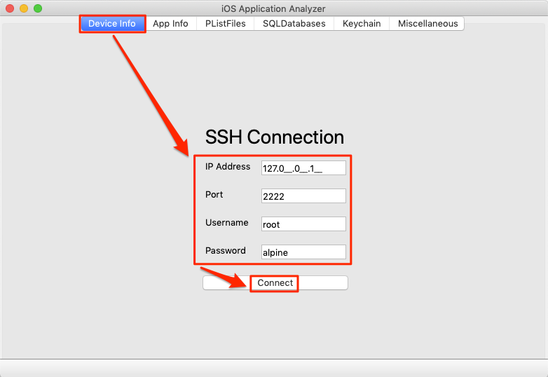
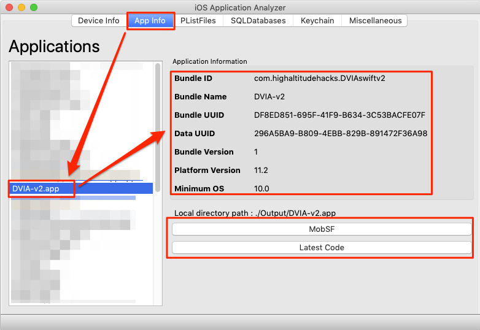
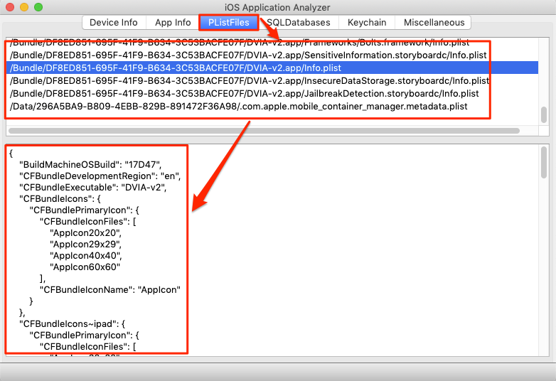
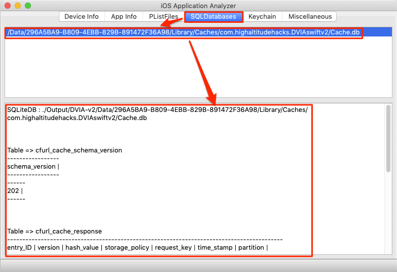
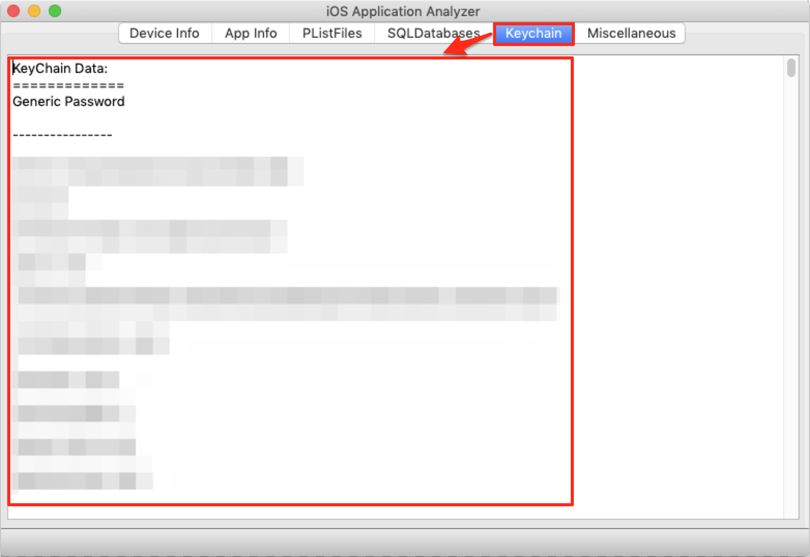

# iOS Application Analyzer

The tool is used to analyze the content of the iOS application in local storage.
 <br /> <br />
- Install and run the application in virutal environment
```
python -m venv ios_application_analyzer
ios_application_analyzer/Scripts/activate
pip install -r requirements.txt
python main.py
```

Download Keychain Dumper from the following link and put inside tools folder
	- https://github.com/ptoomey3/Keychain-Dumper/releases/tag/1.2.0

##### Note: For the performance it is highly recommend to connect device  using USB and  SSH over USB using iproxy or equivalent tools
Reference: https://iphonedevwiki.net/index.php/SSH_Over_USB

For windows: https://github.com/L1ghtmann/libimobiledevice/releases/

# Tool Usage
Run iproxy tool to connect iPhone device over USB as shown in Figure:

<br /> <br />
It will ask for SSH Credential to connect the phone as shown in Figure:

<br /> <br />
Once the SSH connected successfully, application list down all the applicaiton install on the connected device as shown in Figure:<br />

<br /> <br />
It will list down all the pList file specific to selected application and while clicking on list item it will show the data of the pList file as shown in Figure:

<br /> <br />
It will list down all the database file specific to selected applicaiton and while clicking on the list item it will dump all the tables of the selected database file as shown in Figure:

<br /> <br />
Dumps all the data of the KeyChain Database as shown in Figure:


# Future Enhancement
- [ ] Disply iPhone Logs to analyze the logs of the application

# References
- https://iphonedevwiki.net/index.php/SSH_Over_USB
- https://gist.github.com/johnfink8/2190472
- http://damnvulnerableiosapp.com/?paiddownloads_id=11#downloads
- https://github.com/ptoomey3/Keychain-Dumper
